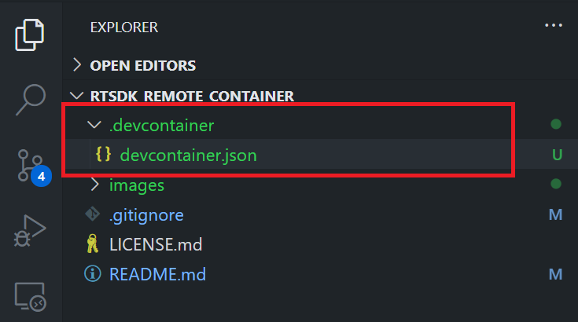
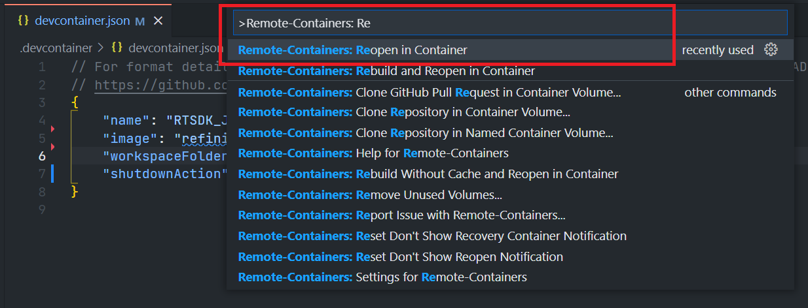
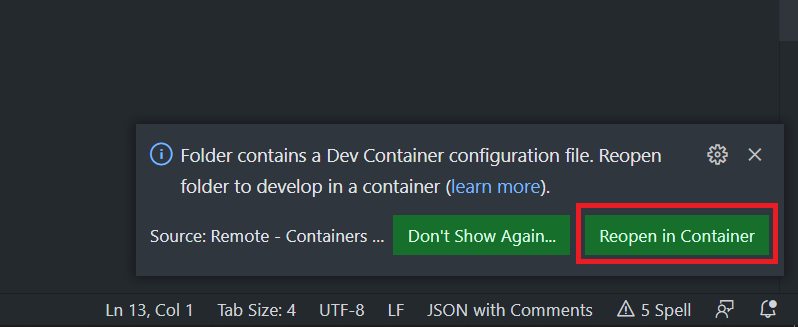
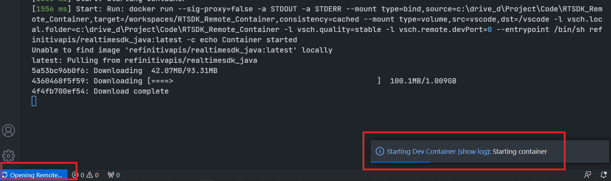
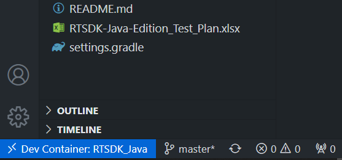

# Develop with Refinitiv Real-Time SDK Docker Image in VS Code Using the Remote - Containers extension
- version: 1.0.1
- Last update: March 2022
- Environment: Docker
- Compiler: Java, C/C++
- Prerequisite: [Demo prerequisite](#prerequisite)

## <a id="intro"></a>Introduction

[Visual Studio Code](https://code.visualstudio.com/) (or just VS Code) is a free source code editor developed and maintained by [Microsoft](https://github.com/Microsoft/vscode). This cross-platform editor rapidly gained popularity with developers as it is fast and lightweight, supports a variety of programming languages with IntelliSense (a feature that has originated with VS Code’s older sibling, Visual Studio IDE), and enables complete development operations like debugging, task running, and version control.

VS Code provides numerous extensions that add features and expand development workflows  (Example: the [REST Client](https://developers.refinitiv.com/en/article-catalog/article/how-to-test-refinitiv-data-platform-rest-api-easily-with-visual-studio-code) and [Thunder Client](https://developers.refinitiv.com/en/article-catalog/article/how-to-test-http-rest-api-easily-with-visual-studio-code---thund) testing tools). VS Code also supports the [remote development](https://code.visualstudio.com/docs/remote/remote-overview) that lets you use a container, remote machine, or the [Windows Subsystem for Linux (WSL)](https://developers.refinitiv.com/en/article-catalog/article/coding-testing-linux-apps-on-windows-with-wsl-windows-subsystem-for-linux) as a full-featured development environment with the [Remote Development Extension Pack](https://marketplace.visualstudio.com/items?itemName=ms-vscode-remote.vscode-remote-extensionpack).

As part of the Remote Development Extension Pack, the [Remote - Containers](https://marketplace.visualstudio.com/items?itemName=ms-vscode-remote.remote-containers) extension lets developers use a Docker container as a full-featured development environment. It allows the developer to open any folder inside (or mounted into) a container and take advantage of Visual Studio Code's full feature set (IntelliSense, code navigation, debugging, etc) as a local-quality development experience.


This article demonstrates how to use VS Code Remote - Containers extension with the Refinitiv Real-Time SDK  Docker images. Developers can explore the RTSDK, build and run the provided examples codes directly in VS Code IDE.

Note: Please note that the Refinitiv Real-Time SDK isn't qualified for the Docker platform. This article and example projects are intended for development and testing purposes only. If any problems are found while running the example code with RTSDK on with Docker platform, the suspected issues must be reproduced on a bare-metal machine prior to contacting the Refinitiv help-desk support team.

## <a id="Introduction"></a>Refinitiv Real-Time SDK Introduction

[Refinitiv Real-Time SDK](https://developers.refinitiv.com/en/use-cases-catalog/refinitiv-real-time) (RTSDK, formerly known as Elektron SDK) is a suite of modern and open source APIs that aim to simplify development through a strong focus on ease of use and standardized access to a broad set of Refinitiv proprietary content and services via the proprietary TCP connection named RSSL and proprietary binary message encoding format named OMM Message. 

 The SDK source code is available on [GitHub](https://github.com/Refinitiv/Real-Time-SDK), developers can build the RTSDK C++ and Java libraries with the [CMake](https://cmake.org/) and [Gradle](https://gradle.org/) build automation tools, C/C++ and Java respectively. If developers are new to the SDK, they can use the following RTSDK Docker images to set up and learn the SDK quickly.
 * [refinitivapis/realtimesdk_c](https://hub.docker.com/r/refinitivapis/realtimesdk_c): This docker image contains the latest version of the RTSDK C/C++ libraries and examples. 
 * [refinitivapis/realtimesdk_java](https://hub.docker.com/r/refinitivapis/realtimesdk_java): This docker image contains the latest version of the RTSDK Java libraries and examples. 

These images include all required dependencies and come with the build scripts and tools. You can check my colleague's [Introduction to the refinitivapis/realtimesdk_c Docker Image](https://developers.refinitiv.com/en/article-catalog/article/introduction-to-the-refinitivapis-elektronsdkc-docker-image) and [Introduction to the refinitivapis/realtimesdk_java Docker Image](https://developers.refinitiv.com/en/article-catalog/article/introduction-to-the-refinitivapis-realtimesdkjava-docker-image) articles for step-by-step guidance on how to deploy and run the RTSDK Docker images via Docker command line. This article focuses on accessing RTSDK docker images from VS Code.
 
 If you are using the WebSocket API, there is [refinitivapis/websocket_api](https://hub.docker.com/r/refinitivapis/websocket_api) docker image that contains the latest version of WebSocket API Examples too.

## <a id="prerequisite"></a>Demo prerequisite
This example requires the following dependencies software and libraries.
1. [Visual Studio Code](https://code.visualstudio.com/) editor.
2. [Docker Desktop/Engine](https://docs.docker.com/get-docker/) application.
3. [VS Code - Remote Development extension pack](https://aka.ms/vscode-remote/download/extension)
4. Access to the Refinitiv Refinitiv Data Platform and Refinitiv Real-Time - Optimized. (for the RTO example only)
5. Internet connection. 

I highly recommend following [System requirements](https://code.visualstudio.com/docs/remote/containers#_system-requirements) and [Installation](https://code.visualstudio.com/docs/remote/containers#_installation) sections to set up your environment.

## <a id="devcontainer_json"></a>A devcontainer.json file

The main configuration file that tells VS Code how to access (or create) a development container (aka "Dev container") with a well-defined tool and runtime stack is named ```devcontainer.json``` file. The dev container configuration is either located under ```.devcontainer/devcontainer.json``` or stored as in a file named ```.devcontainer.json``` file (*note the dot-prefix*) in the root of the project.



**Note**: Make sure to commit a ```.devcontainer``` folder to your version control system.

Let me explain these configurations:

```
// For format details, see https://aka.ms/devcontainer.json. For config options, see the README at:
// https://github.com/microsoft/vscode-dev-containers/tree/v0.202.5/containers/
{
    "name": "RTSDK_Java",
    "image": "refinitivapis/realtimesdk_java:latest",
}
```
The detail of the configurations above are:
- ```name```: A display name for the container.
- ```image```: The name of an image in a container registry that VS Code should use to create the dev container.

The development container lets you pull images from [DockerHub](https://hub.docker.com/), [GitHub](https://docs.github.com/en/packages/guides/about-github-container-registry), and [Azure](https://azure.microsoft.com/services/container-registry/) Container Registry repositories, and then perform additional tasks such as install development tools (Git, etc.), install VS Code extensions, forward ports, set runtime arguments, etc.

The development container is not limited to Docker images, it supports [Dockerfile](https://code.visualstudio.com/docs/remote/create-dev-container#_dockerfile) and [Docker Compose](https://code.visualstudio.com/docs/remote/create-dev-container#_use-docker-compose) too. You can build your image(s) to match your development requirements, and then share ```Dockerfile``` and/or ```docker-compose.yml``` inside a ```.devcontainer``` folder (with a ```devcontainer.json``` file) with your colleagues to help them to set up the same development environment.

Please find more details about all devcontainer.json configuration parameters on the [VS Code - devcontainer.json reference](https://code.visualstudio.com/docs/remote/devcontainerjson-reference) page.

### <a id="rtsdk_devcontainer_json"></a>The RTSDK devcontainer.json file

Let's start by creating a ```devcontainer.json``` file that pulls the refinitivapis/realtimesdk_java from the DockerHub repository. 

```
// For format details, see https://aka.ms/devcontainer.json. For config options, see the README at:
// https://github.com/microsoft/vscode-dev-containers/tree/v0.202.5/containers/
{
    "name": "RTSDK_Java",
    "image": "refinitivapis/realtimesdk_java:latest",
    "workspaceFolder": "/opt/refinitiv/Real-Time-SDK/Java",
    "shutdownAction":"stopContainer"
}
```
The ```devcontainer.json``` file above sets the following development properties:

- ```name```: Using "RTSDK_Java" as a display name of the container.
- ```image```: Pull "refinitivapis/realtimesdk_java" Docker image from DockerHub [https://hub.docker.com/r/refinitivapis/realtimesdk_java](https://hub.docker.com/r/refinitivapis/realtimesdk_java) URL.
- ```workspaceFolder```: Sets the default path that VS Code should open when connecting to the container. This ```devcontainer.json``` sets the default path to **/opt/refinitiv/Real-Time-SDK/Java** which is the RTSDK Java package location in the container.
- ```shutdownAction```: set the VS Code stops the container when the editor window is closed / shut down.

### <a id="start_dev_container"></a>Running the Development Container

**Docker Desktop/engine should be running prior to the next step.**

You can connect to the container and start developing within it by selecting the **Remote-Containers: Reopen in Container** command from the VS Code Command Palette (F1).



Alternatively, the VS Code can detect whether there is a folder containing a Dev container configuration file, and then asks you if you want to reopen the folder in a container.



Next, the VS Code window (instance) will reload, pull (or clone) the image, and start building the dev container. Please note that if the image already a



There may be a message “Extension Pack for Java is recommended for this repository.” At this point, may be good to install the Extension for Java, as we intend to use RTSDK Java.

Once this build completes, VS Code automatically connects to the container at the path we set to the ```workspaceFolder``` property which is the **/opt/refinitiv/Real-Time-SDK/Java** folder.  You can check the VS Code Remote connection status from the button left toolbar.



If you click this toolbar, VS Code shows the Container Remote connection menu options at the top of the editor.


To close the remote connection, choose the "Close Remote Connection" from the drop-down menu. 

##  <a id="project_files"></a>Project files
This example project contains the following files and folders
1. *.devcontainer/devcontainer.json*: An example development container configuration file.
2. *images*: Project images folder.
3. *LICENSE.md*: Project's license file.
4. *README.md*: Project's README file.
5. *RTSDK_DevContainer.md.md*: Project's Document file.

## <a id="how_to_run"></a>How to run the Examples

The first step is to unzip or download the example project folder into a directory of your choice, then set up RTSDK Java or C++ Docker Dev container in a ```devcontainer.json``` file based on your preference.

1. Start a Docker desktop or Docker engine in your machine.
2. Open the project folder in the VS Code editor
3. Install the [VS Code - Remote Development extension pack](https://aka.ms/vscode-remote/download/extension).
4. Open the VS Code Command Palette with the ```F1``` key, and then select the **Remote-Containers: Reopen in Container** command.


Now  VS Code is ready to run RTSDK Java (or C++) Dev container. Please see the full details over the RTSDK and VS Code Dev Container integrations on the [RTSDK_DevContainer.md](RTSDK_DevContainer.md) file.


## <a id="conclusion"></a>Conclusion and Next Steps

Docker is an open containerization platform for developing, testing, deploying, and running any software application. It helps developers create a consistent development environment without manually maintaining dependencies and toolsets for the project. The VS Code [Remote - Containers](https://marketplace.visualstudio.com/items?itemName=ms-vscode-remote.remote-containers) extension makes developers work with Docker easier, by integrating VS Code into a Docker container as a full-featured development environment. The extension allows developers to open any folder inside (or mounted into) a container and take advantage of the VS Code’s rich feature set.

This example project is just a brief introduction to the Remote - Containers extension. Developers can work with [Dockerfile](https://code.visualstudio.com/docs/remote/create-dev-container#_dockerfile) and [Docker Compose](https://code.visualstudio.com/docs/remote/create-dev-container#_use-docker-compose) to build a customized Docker image that matches the development requirements, [debugging](https://code.visualstudio.com/docs/remote/containers#_debugging-in-a-container), install various VS Code extensions to use in the Dev Container (via the [GUI](https://code.visualstudio.com/docs/remote/containers#_managing-extensions) or [configuration file](https://code.visualstudio.com/docs/remote/containers#_adding-an-extension-to-devcontainerjson)), [clone Docker container from Git repository](https://code.visualstudio.com/docs/remote/containers#_quick-start-open-a-git-repository-or-github-pr-in-an-isolated-container-volume), [attach the VS Code to a running container](https://code.visualstudio.com/docs/remote/containers#_attach-to-existing-container), [port forwarding](https://code.visualstudio.com/docs/remote/containers#_always-forwarding-a-port), and much more. I highly recommend you check the following VS Code resources for more details:
* [Developing inside a Container](https://code.visualstudio.com/docs/remote/containers)
* [Remote development in Containers tutorial](https://code.visualstudio.com/docs/remote/containers-tutorial)
* [Create a development container](https://code.visualstudio.com/docs/remote/create-dev-container)
* [devcontainer.json reference](https://code.visualstudio.com/docs/remote/devcontainerjson-reference)


The [refinitivapis/realtimesdk_c](https://hub.docker.com/r/refinitivapis/realtimesdk_c), [refinitivapis/realtimesdk_java](https://hub.docker.com/r/refinitivapis/realtimesdk_java), and [refinitivapis/websocket_api](https://hub.docker.com/r/refinitivapis/websocket_api) docker images are good starting points for developers who are new to the [Refinitiv Real-Time SDK](https://developers.refinitiv.com/en/use-cases-catalog/refinitiv-real-time). Developers can use the Docker image with the Remote - Containers extensions to set up a development environment, that makes running RTSDK examples in VS Code. 

If you are the developers who are already familiar with Maven, I highly recommend you check the [How to deploy and run Real-Time Java Application with Maven in Docker](https://developers.refinitiv.com/en/article-catalog/article/how-to-deploy-and-run-real-time-java-application-with-maven-in-d) that shows how to use Maven to set up an RTSDK Java development environment in a Docker container.

## <a id="ref"></a>References

For further details, please review the following resources:
* [Refinitiv Real-Time SDK Java page](https://developers.refinitiv.com/en/api-catalog/refinitiv-real-time-opnsrc/rt-sdk-java) on the [Refinitiv Developer Community](https://developers.refinitiv.com/) website.
* [Refinitiv Real-Time SDK Family](https://developers.refinitiv.com/en/use-cases-catalog/refinitiv-real-time) page.
* [Enterprise Message API Java Quick Start](https://developers.refinitiv.com/en/api-catalog/refinitiv-real-time-opnsrc/rt-sdk-java/quick-start)
* [Developer Webinar: Introduction to Enterprise App Creation With Open-Source Enterprise Message API](https://www.youtube.com/watch?v=2pyhYmgHxlU)
* [Developer Article: 10 important things you need to know before you write an Enterprise Real Time application](https://developers.refinitiv.com/article/10-important-things-you-need-know-you-write-elektron-real-time-application)
* [Introduction to the refinitivapis/realtimesdk_c Docker Image](https://developers.refinitiv.com/en/article-catalog/article/introduction-to-the-refinitivapis-elektronsdkc-docker-image)
* [Introduction to the refinitivapis/realtimesdk_java Docker Image](https://developers.refinitiv.com/en/article-catalog/article/introduction-to-the-refinitivapis-realtimesdkjava-docker-image) article.
* [Deploy and Run Refinitiv Real-Time SDK in Docker](https://developers.refinitiv.com/en/article-catalog/article/deploy-and-run-elektron-sdk-docker) article.
* [How to deploy and run Real-Time Java Application with Maven in Docker](https://developers.refinitiv.com/en/article-catalog/article/how-to-deploy-and-run-real-time-java-application-with-maven-in-d) article.
* [VS Code: Developing inside a Container](https://code.visualstudio.com/docs/remote/containers) page.
* [VS Code: Remote development in Containers tutorial](https://code.visualstudio.com/docs/remote/containers-tutorial) page.
* [VS Code: Create a development container](https://code.visualstudio.com/docs/remote/create-dev-container) page.
* [VS Code: devcontainer.json reference](https://code.visualstudio.com/docs/remote/devcontainerjson-reference) page.
* [Setting up a VS Code Dev Container](https://benmatselby.dev/post/vscode-dev-containers/) blog post.
* [Hands-On with VSCode & "Dev Containers"](https://dev.to/mcastellin/hands-on-with-vscode-dev-containers-33bf) blog post.
* [Development Acceleration Through VS Code Remote Containers: An Introduction](https://stelligent.com/2020/03/20/development-acceleration-through-vs-code-remote-containers-an-introduction/) blog post.

For any questions related to this article or the RTSDK page, please use the Developer Community [Q&A Forum](https://community.developers.refinitiv.com/spaces/71/index.html).

## Developers Articles

* [Develop with Refinitiv Real-Time SDK Docker Image in VS Code Using the Remote-Containers extension](https://developers.refinitiv.com/en/article-catalog/article/develop-with-refinitiv-real-time-sdk-docker-image-in-vs-code) article.
* [Develop with Refinitiv Real-Time SDK Docker Image in VS Code Using the Remote-Containers extension](https://medium.com/refinitivdeveloper/how-to-use-the-visual-studio-code-remote-containers-extension-with-real-time-sdk-docker-image-4826f6f9e236) Medium post.