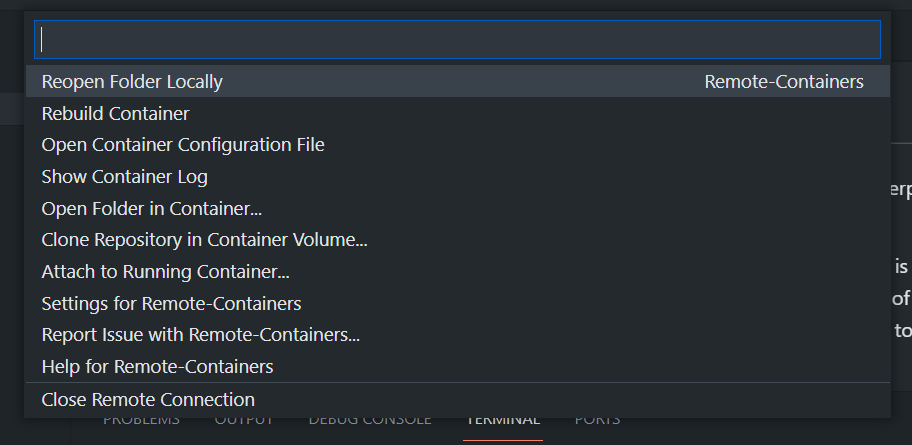
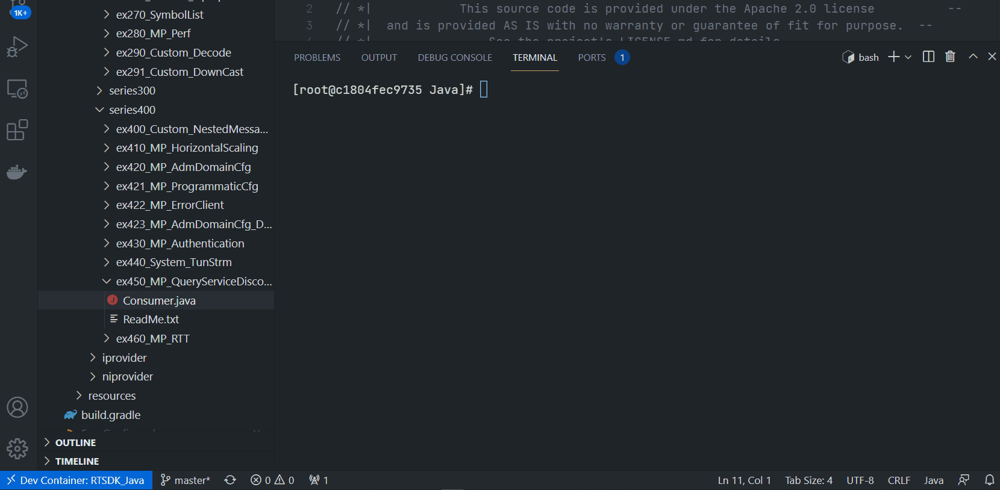
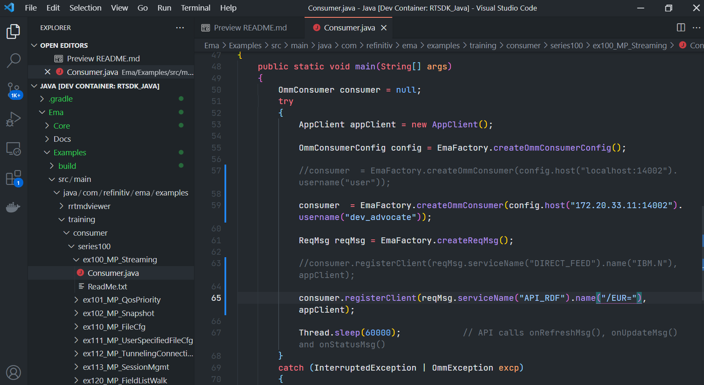

# How to Develop the Real-Time application inside the 
- version: 1.0.0
- Last update: November 2021
- Environment: Docker
- Compiler: Java
- Prerequisite: [Demo prerequisite](#prerequisite)

## <a id="intro"></a>Introduction

[Visual Studio Code](https://code.visualstudio.com/) (or just VS Code) is a free source code editor developed and maintained by [Microsoft](https://github.com/Microsoft/vscode). This cross-platform editor took over developers' popularity based on its fast and lightweight, supports a variety of programming languages with IntelliSense (a feature that borrows from its sibling, Visual Studio IDE), and supports complete development operations like debugging, task running, and version control.

VS Code provides a lot of extensions that extend the editor features and development workflows (Example: the [REST Client](https://developers.refinitiv.com/en/article-catalog/article/how-to-test-refinitiv-data-platform-rest-api-easily-with-visual-studio-code) and [Thunder Client](https://developers.refinitiv.com/en/article-catalog/article/how-to-test-http-rest-api-easily-with-visual-studio-code---thund) testing tools) for developers. The editor also supports the [remote development](https://code.visualstudio.com/docs/remote/remote-overview) that lets you use a container, remote machine, or the [Windows Subsystem for Linux (WSL)](https://docs.microsoft.com/windows/wsl) as a full-featured development environment with the [Remote Development Extension Pack](https://marketplace.visualstudio.com/items?itemName=ms-vscode-remote.vscode-remote-extensionpack).

As part of the Remote Development Extension Pack, the [Remote - Containers](https://marketplace.visualstudio.com/items?itemName=ms-vscode-remote.remote-containers) extension lets developers use a Docker container as a full-featured development environment. It allows developer to open any folder inside (or mounted into) a container and take advantage of Visual Studio Code's full feature set (IntelliSense , code navigation, debugging, etc) as a local-quality development experience.


This article demonstrates how to use the VS Code Remote - Containers extension with the Refinitiv Real-Time SDK on the Docker platform as example images. Developers can explorer the SDK building system and example codes on the VS Code editor directly.

**Note**: Please note that the Refinitiv Real-Time SDK isn't qualified on the Docker platform. This article and example projects aim for Development and Testing purposes only. If you find any problems while running it on the Docker platform, the issues must be replicated on bare metal machines before contacting the help-desk support team.

## <a id="Introduction"></a>Refinitiv Real-Time SDK Introduction

[Refinitiv Real-Time SDK](https://developers.refinitiv.com/en/use-cases-catalog/refinitiv-real-time) (RTSDK, formerly known as Elektron SDK) is a suite of modern and open source APIs that aim to simplify development through a strong focus on ease of use and standardized access to a broad set of Refinitiv proprietary content and services via the proprietary TCP connection named RSSL and proprietary binary message encoding format named OMM Message. 

 The SDK source code is available on [GitHub](https://github.com/Refinitiv/Real-Time-SDK), developers can built the RTSDK C++ and Java libraries with the [CMake](https://cmake.org/) and [Gradle](https://gradle.org/) build automation tools respectively. If developers is new to the SDK, they can use the following RTSDK Docker images to set up and learn the SDK quickly.
 * [refinitivapis/realtimesdk_c](https://hub.docker.com/r/refinitivapis/realtimesdk_c): This docker image contains the latest version of the RTSDK C/C++ libraries and examples. 
 * [refinitivapis/realtimesdk_java](https://hub.docker.com/r/refinitivapis/realtimesdk_java): This docker image contains the latest version of the RTSDK Java libraries and examples. 

The images have all dependencies and the building system pre-installed. You can check my colleague's [Introduction to the refinitivapis/realtimesdk_c Docker Image](https://developers.refinitiv.com/en/article-catalog/article/introduction-to-the-refinitivapis-elektronsdkc-docker-image) and [Introduction to the refinitivapis/realtimesdk_java Docker Image](https://developers.refinitiv.com/en/article-catalog/article/introduction-to-the-refinitivapis-realtimesdkjava-docker-image) articles that show a step-by-step guide to deploy and run the RTSDK Docker images via the Docker command line. This article is focusing on access the images with VS Code editor.
 
 If you are using the WebSocket API, there is the [refinitivapis/websocket_api](https://hub.docker.com/r/refinitivapis/websocket_api) docker image that contains the latest version WebSocket API Examples too.

## <a id="prerequisite"></a>Demo prerequisite
This example requires the following dependencies software and libraries.
1. [Visual Studio Code](https://code.visualstudio.com/) editor.
2. [Docker Desktop/Engine](https://docs.docker.com/get-docker/) application.
3. [VS Code - Remote Development extension pack](https://aka.ms/vscode-remote/download/extension)
4. Access to the Refinitiv Refinitiv Data Platform and Refinitiv Real-Time - Optimized. (for the RTO example only)
5. Internet connection. 

I highly recommend you check the extension [System requirements](https://code.visualstudio.com/docs/remote/containers#_system-requirements) and [Installation](https://code.visualstudio.com/docs/remote/containers#_installation) sections to set up your environment.

## <a id="devcontainer_json"></a>A devcontainer.json file

The main configuration file that tells VS Code how to access (or create) a development container (aka Dev container) with a well-defined tool and runtime stack is a ```devcontainer.json``` file. The dev container configuration is either located under ```.devcontainer/devcontainer.json``` or stored as a ```.devcontainer.json``` file (*note the dot-prefix*) in the root of your project.


**Note**: Make sure to commit a ```.devcontainer``` folder to your version control system.

The basic configuration parameters are as follows:

```
// For format details, see https://aka.ms/devcontainer.json. For config options, see the README at:
// https://github.com/microsoft/vscode-dev-containers/tree/v0.202.5/containers/
{
	"name": "RTSDK_Java",
	"image": "refinitivapis/realtimesdk_java:latest",
}
```
The detail of the configurations above are:
- ```name```: A display name for the container.
- ```image```: The name of an image in a container registry that VS Code should use to create the dev container.

The development container lets you pull images from [DockerHub](https://hub.docker.com/), [GitHub](https://docs.github.com/en/packages/guides/about-github-container-registry), and [Azure](https://azure.microsoft.com/services/container-registry/) Container Registry repositories, and then perform additional tasks such as install development tools (Git, etc.), install VS Code extensions, forward ports, set runtime arguments, etc.

The development container is not limited to Docker images, it supports [Dockerfile](https://code.visualstudio.com/docs/remote/create-dev-container#_dockerfile) and [Docker Compose](https://code.visualstudio.com/docs/remote/create-dev-container#_use-docker-compose)too. You can build own image(s) to match your development requirements, and then share ```Dockerfile``` and/or ```docker-compose.yml``` inside a ```.devcontainer``` folder (with a ```devcontainer.json``` file) to your peer to set up the same development environment.

### <a id="rtsdk_devcontainer_json"></a>The RTSDK devcontainer.json file

Let's start with a ```devcontainer.json``` file that pulls the refinitivapis/realtimesdk_java from DockerHub repository. 

```
// For format details, see https://aka.ms/devcontainer.json. For config options, see the README at:
// https://github.com/microsoft/vscode-dev-containers/tree/v0.202.5/containers/
{
	"name": "RTSDK_Java",
	"image": "refinitivapis/realtimesdk_java:latest",
	"extensions": ["vscjava.vscode-java-pack"],
	"workspaceFolder": "/opt/refinitiv/Real-Time-SDK/Java",
}
```
The ```devcontainer.json``` file above sets the following development properties:

- ```name```: Using "RTSDK_Java" as a display name of the container.
- ```image```: Pull "refinitivapis/realtimesdk_java" Docker image from DockerHub [https://hub.docker.com/r/refinitivapis/realtimesdk_java](https://hub.docker.com/r/refinitivapis/realtimesdk_java) URL.
- ```extensions```: An array of extension IDs that specify the extensions that should be installed inside the container when it is created. This ```devcontainer.json``` installs the [Extension Pack for Java](https://marketplace.visualstudio.com/items?itemName=vscjava.vscode-java-pack) in the development container.
- ```workspaceFolder```: Sets the default path that VS Code should open when connecting to the container. This ```devcontainer.json``` sets the default path to **/opt/refinitiv/Real-Time-SDK/Java** which is the RTSDK Java package location in the container.

### <a id=""></a>Running the Development Container

You can connect to the container and start developing within it by selecting the **Remote-Containers: Reopen in Container** command from the VS Code Command Palette (F1).


Alternatively, the VS Code can detect whether there is a folder contains a Dev container configuration file, and then asks you if you want to reopen folder in a container.


Next, the VS Code window (instance) will reload, pull (or clone) the image, and start building the dev container. Please note that if the image already a


After the build completes, VS Code automatically connects to the container at the path we set to the ```workspaceFolder``` property which is the **/opt/refinitiv/Real-Time-SDK/Java** folder.  You can check the VS Code Remote connection status from the button left toolbar.


If you click this toolbar, the VS Code shows the Container Remote connection options at the top of the editor.




Now your VS Code and Dev container are ready to run.

### <a id=""></a>Running the RTSDK Java Examples

All files and sub-folders are available in the Code explorer. If you open a terminal (``` Ctrl+` ``` or ``` Ctrl+Shift+` ``` - Windows), the current location is  **/opt/refinitiv/Real-Time-SDK/Java** folder too (You can navigate to other locations in the container as well)


The *refinitivapis/realtimesdk_java* Docker image has built-in all RTSDK Java dependencies and build system, so you can run the SDK examples with the Gradle tool from the VS Code terminal. I am demonstrating with the EMA Java Consumer - Interactive Provider scenario example.

Firstly, open a terminal and run the EMA Java IProvider example 200.

```
$>./gradlew runiprovider200
```

Next, open a new terminal in the same VS Code editor with the ``` Ctrl+Shift+` ``` command, and run the EMA Java Consumer example 200.

```
$>./gradlew runconsumer100
```
The results of EMA Java Consumer - Interactive Provider examples scenario is shown below.


You can run the RTO example, EMA Java ex450_MP_QueryServiceDiscovery with the following command.

```
$>../gradlew runconsumer450 -PcommandLineArgs="-username Machine-ID -password RTO-Password -clientId App_Key -itemName <RIC name>"
```

The result is shown below.



If you have your own RTDS server in your environment, you can modify the example code to match your RTDS connection requirement. The following example shows the ex100_MP_Streaming example that has been changed the RTDS server endpoint, service name, and RIC name.



Then, developers can run this example application with ```./gradlew runconsumer100``` command.


## <a id="ref"></a>References

For further details, please check out the following resources:
* [Refinitiv Real-Time SDK Java page](https://developers.refinitiv.com/en/api-catalog/refinitiv-real-time-opnsrc/rt-sdk-java) on the [Refinitiv Developer Community](https://developers.refinitiv.com/) website.
* [Refinitiv Real-Time SDK Family](https://developers.refinitiv.com/en/use-cases-catalog/refinitiv-real-time) page.
* [Enterprise Message API Java Quick Start](https://developers.refinitiv.com/en/api-catalog/refinitiv-real-time-opnsrc/rt-sdk-java/quick-start)
* [Developer Webinar: Introduction to Enterprise App Creation With Open-Source Enterprise Message API](https://www.youtube.com/watch?v=2pyhYmgHxlU)
* [Developer Article: 10 important things you need to know before you write an Enterprise Real Time application](https://developers.refinitiv.com/article/10-important-things-you-need-know-you-write-elektron-real-time-application)
* [Introduction to the refinitivapis/realtimesdk_c Docker Image](https://developers.refinitiv.com/en/article-catalog/article/introduction-to-the-refinitivapis-elektronsdkc-docker-image)
* [Introduction to the refinitivapis/realtimesdk_java Docker Image](https://developers.refinitiv.com/en/article-catalog/article/introduction-to-the-refinitivapis-realtimesdkjava-docker-image) article.
* [Deploy and Run Refinitiv Real-Time SDK in Docker](https://developers.refinitiv.com/en/article-catalog/article/deploy-and-run-elektron-sdk-docker) article.

https://benmatselby.dev/post/vscode-dev-containers/
https://code.visualstudio.com/docs/remote/create-dev-container#_use-docker-compose

For any questions related to this article or RTSDK page, please use the Developer Community [Q&A Forum](https://community.developers.refinitiv.com/).