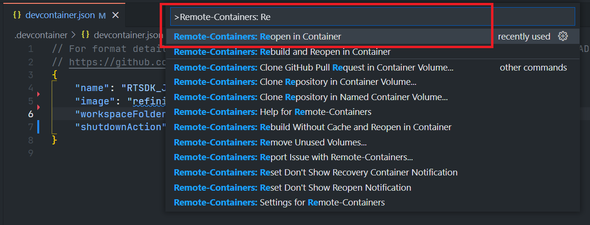
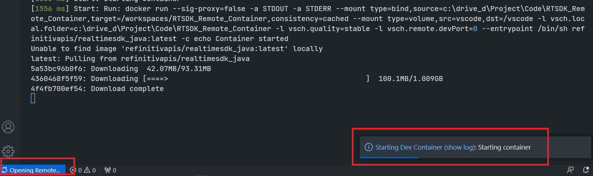
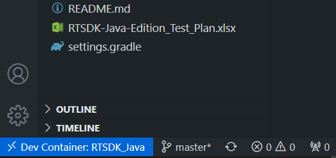
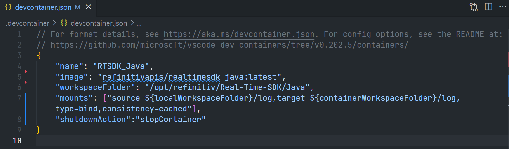
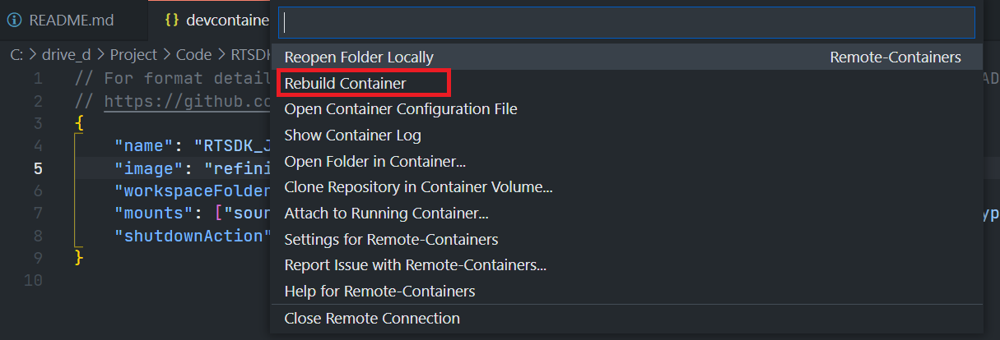

# How to use the Refinitiv Real-Time SDK Docker Images on the Visual Studio Code with the Remote - Containers extension
- version: 1.0.0
- Last update: January 2022
- Environment: Docker
- Compiler: Java
- Prerequisite: [Demo prerequisite](#prerequisite)

## <a id="devcontainer_json"></a>A devcontainer.json file

The main configuration file that tells VS Code how to access (or create) a development container (aka "Dev container") with a well-defined tool and runtime stack is named ```devcontainer.json``` file. The dev container configuration is either located under ```.devcontainer/devcontainer.json``` or stored as in a file named ```.devcontainer.json``` file (*note the dot-prefix*) in the root of the project.


**Note**: Make sure to commit a ```.devcontainer``` folder to your version control system.

The basic configuration parameters are as follows:

```
// For format details, see https://aka.ms/devcontainer.json. For config options, see the README at:
// https://github.com/microsoft/vscode-dev-containers/tree/v0.202.5/containers/
{
    "name": "RTSDK_Java",
    "image": "refinitivapis/realtimesdk_java:latest",
}
```
Let me explain these configurations:
- ```name```: A display name for the container.
- ```image```: The name of an image in a container registry that VS Code should use to create the dev container.

The development container lets you pull images from [DockerHub](https://hub.docker.com/), [GitHub](https://docs.github.com/en/packages/guides/about-github-container-registry), and [Azure](https://azure.microsoft.com/services/container-registry/) Container Registry repositories, and then perform additional tasks such as install development tools (Git, etc.), install VS Code extensions, forward ports, set runtime arguments, etc.

The development container is not limited to Docker images, it supports [Dockerfile](https://code.visualstudio.com/docs/remote/create-dev-container#_dockerfile) and [Docker Compose](https://code.visualstudio.com/docs/remote/create-dev-container#_use-docker-compose) too. You can build your image(s) to match your development requirements, and then share ```Dockerfile``` and/or ```docker-compose.yml``` inside a ```.devcontainer``` folder (with a ```devcontainer.json``` file) with your colleagues to help them to set up the same development environment.

Please find more details about all devcontainer.json configuration parameters on the [VS Code - devcontainer.json reference](https://code.visualstudio.com/docs/remote/devcontainerjson-reference) page.

### <a id="rtsdk_devcontainer_json"></a>The RTSDK devcontainer.json file

Let's start by creating a ```devcontainer.json``` file that pulls the refinitivapis/realtimesdk_java from the DockerHub repository.

```
// For format details, see https://aka.ms/devcontainer.json. For config options, see the README at:
// https://github.com/microsoft/vscode-dev-containers/tree/v0.202.5/containers/
{
    "name": "RTSDK_Java",
    "image": "refinitivapis/realtimesdk_java:latest",
    "workspaceFolder": "/opt/refinitiv/Real-Time-SDK/Java",
    "shutdownAction":"stopContainer"
}
```
The ```devcontainer.json``` file above sets the following development properties:

- ```name```: Using "RTSDK_Java" as a display name of the container.
- ```image```: Pull "refinitivapis/realtimesdk_java" Docker image from DockerHub [https://hub.docker.com/r/refinitivapis/realtimesdk_java](https://hub.docker.com/r/refinitivapis/realtimesdk_java) URL.
- ```workspaceFolder```: Sets the default path that VS Code should open when connecting to the container. This ```devcontainer.json``` sets the default path to **/opt/refinitiv/Real-Time-SDK/Java** which is the RTSDK Java package location in the container.
- ```shutdownAction```: set the VS Code stops the container when the editor window is closed / shut down.

### <a id="start_dev_container"></a>Running the Development Container

**Docker Desktop/engine should be running prior to the next step.**

You can connect to the container and start developing within it by selecting the **Remote-Containers: Reopen in Container** command from the VS Code Command Palette (F1).



Alternatively, the VS Code can detect whether there is a folder containing a Dev container configuration file, and then asks you if you want to reopen the folder in a container.


Next, the VS Code window (instance) will reload, pull (or clone) the image, and start building the dev container.



There may be a message “Extension Pack for Java is recommended for this repository.” At this point, may be good to install the Extension for Java, as we intend to use RTSDK Java.

Once this build completes, VS Code automatically connects to the container at the path we set to the ```workspaceFolder``` property which is the **/opt/refinitiv/Real-Time-SDK/Java** folder.  You can check the VS Code Remote connection status from the button left toolbar.



If you click this toolbar, VS Code shows the Container Remote connection menu options at the top of the editor.


To close the remote connection, choose the "Close Remote Connection" from the drop-down menu. 

Now your VS Code and Dev container are ready to run the RTSDK Java example applications.

### <a id="emajava_running"></a>Running the RTSDK Java Examples

All files and sub-folders are available in the VS Code explorer. If you open a terminal (``` Ctrl+` ``` or ``` Ctrl+Shift+` ``` - Windows), the current location is  **/opt/refinitiv/Real-Time-SDK/Java** folder too (You can navigate to other locations in the container as well)


The *refinitivapis/realtimesdk_java* Docker image has built-in all RTSDK Java dependencies and build system, so you can run the SDK examples with the Gradle tool from the VS Code terminal. I am demonstrating with the EMA Java Consumer - Interactive Provider scenario example.

Firstly, open a terminal and run the EMA Java IProvider example 200.

```
$>./gradlew runiprovider200
```

Next, open a new terminal in the same VS Code editor with the ``` Ctrl+Shift+` ``` command, and run the EMA Java Consumer example 100.

```
$>./gradlew runconsumer100
```
The results of the EMA Java Consumer - Interactive Provider examples scenario are shown below.


You can run the RTO example, EMA Java ex450_MP_QueryServiceDiscovery with the following command.

```
$>./gradlew runconsumer450 -PcommandLineArgs="-username Machine-ID -password RTO-Password -clientId App_Key -itemName <RIC name>"
```

The result is shown below.


If you have your own RTDS server in your environment, you can modify the example code to match your RTDS connection requirement. The following example shows the ex100_MP_Streaming example that has been changed the RTDS server endpoint, service name, and RIC name.


Then, developers can run this example application with the ```./gradlew runconsumer100``` command.

Please find more details regarding how to run the RTSDK Java examples on the [RTSDK Java - Quick Start](https://developers.refinitiv.com/en/api-catalog/refinitiv-real-time-opnsrc/rt-sdk-java/quick-start) page.

## <a id="dev_container_folder"></a>File Sharing between the Host and Dev Container

Please note that all changes (newly created/modified files and folders) stay in the Dev container as long as the container exists (status **Up/Running** and **Exited**). However, if you remove the container (```docker rm```), that container and its data are destroyed. You can additionally mount points to add to the container when created for sharing files between the host and Dev container with a devcontainer.json's ```mounts``` attribute.

```
// For format details, see https://aka.ms/devcontainer.json. For config options, see the README at:
// https://github.com/microsoft/vscode-dev-containers/tree/v0.202.5/containers/
{
    "name": "RTSDK_Java",
    "image": "refinitivapis/realtimesdk_java:latest",
    "workspaceFolder": "/opt/refinitiv/Real-Time-SDK/Java",
    "mounts": ["source=${localWorkspaceFolder}/log,target=${containerWorkspaceFolder}/log,type=bind,consistency=cached"],
    "shutdownAction":"stopContainer"
}

```

The ```devcontainer.json``` file above mounts the current ```<host workspace location>/log``` folder to the ```/opt/refinitiv/Real-Time-SDK/Java/log``` folder in a container. If the folder does not exist (either host or container), the VS Code automatically creates a folder(s) for you.

**Caution**: Please note that if you mount a host folder to an existing container folder (example: /opt/refinitiv/Real-Time-SDK/Java), the container folder will be replaced by a host folder.

Please find more details regarding the mounts property from the [VS Code - Add another local file mount](https://code.visualstudio.com/remote/advancedcontainers/add-local-file-mount#advancedcontainers-articles) page.

### <a id="emajava_log"></a>Adding EMA Java Log

The best way to demonstrate this feature is enabling the EMA API log messages to capture the API and HTTP REST activities. You do not need to close the remote-connection before updating the devcontainer.json. You can choose the "Open Container Configuration File" in the remote connection menu to open the current devcontainer.json file.


The current devcontainer.json file will be shown in the VS Code editor, you can add the ```"mounts": ["source=${localWorkspaceFolder}/log,target=${containerWorkspaceFolder}/log,type=bind,consistency=cached"]``` configuration to the file.



Next, choose the "Rebuild Container" from the remote connection menu.



After the re-build completes, VS Code automatically creates log folder on the host file system and  */opt/refinitiv/Real-Time-SDK/Java/log* container's folder.  

The ```ls``` command helps verify the presence of the mounted folder:


To enable the EMA Java log file, create a [Java Logging API](https://docs.oracle.com/javase/8/docs/api/java/util/logging/package-summary.html) ```logging.properties``` file in the */opt/refinitiv/Real-Time-SDK/Java/log* folder with the following content:

```
.level=FINEST

handlers=java.util.logging.FileHandler, java.util.logging.ConsoleHandler

java.util.logging.ConsoleHandler.level=FINEST
java.util.logging.ConsoleHandler.formatter=java.util.logging.SimpleFormatter

com.refinitiv.eta.valueadd.reactor.RestReactor.level=FINEST
java.util.logging.FileHandler.level=FINEST
java.util.logging.FileHandler.pattern=/opt/refinitiv/Real-Time-SDK/Java/log/ema.log
 
# Format timestamp as date/time with millisecond
java.util.logging.SimpleFormatter.format=%1$tY-%1$tm-%1$td %1$tH:%1$tM:%1$tS.%1$tL %4$-7s %2$s %n%5$s
```

A logging configuration file sets the EMA API to log all API messages to the ```/opt/refinitiv/Real-Time-SDK/Java/log/ema.log``` file. 

Finally, run the EMA Java ex450_MP_QueryServiceDiscovery RTO example with the ```-PvmArgs="-Djava.util.logging.config.file=/opt/refinitiv/Real-Time-SDK/Java/log/logging.properties"``` argument.


```
$>./gradlew runconsumer450 -PcommandLineArgs="-username Machine-ID -password RTO-Password -clientId App_Key -itemName <RIC name>" -PvmArgs="-Djava.util.logging.config.file=/opt/refinitiv/Real-Time-SDK/Java/log/logging.properties"
```
Then the API activities, HTTP REST messages log messages are stored in the ```ema.log``` file, the logging.properties and log files are available in the host machine too.


You can mount other folders to keep the modified code from the Dev Container back to the host (note: do not mount folders to the container existing folders).

### <a id="rtsdk_cpp"></a>Running the RTSDK C++ Image

To run the Dev container with the RTSDK C++ Docker image, you can set a ```devcontainer.json``` content to load the [refinitivapis/realtimesdk_c](https://hub.docker.com/r/refinitivapis/realtimesdk_c) from Docker Hub and change the ```workspaceFolder``` property to the **/opt/refinitiv/Real-Time-SDK/Cpp-C** folder as follows.

```
// For format details, see https://aka.ms/devcontainer.json. For config options, see the README at:
// https://github.com/microsoft/vscode-dev-containers/tree/v0.202.5/containers/
{
    "name": "RTSDK_CPP",
    "image": "refinitivapis/realtimesdk_c:latest",
    "workspaceFolder": "/opt/refinitiv/Real-Time-SDK/Cpp-C",
    "mounts": ["source=${localWorkspaceFolder}/log,target=${containerWorkspaceFolder}/log,type=bind,consistency=cached"],
    "shutdownAction":"stopContainer"
}
```
Then, run the "Remote-Containers: Rebuild and Reopen in Container" command (or "Remote-Containers: Reopen in Container" if you are running the Dev container for the first time). After the build completes, VS Code automatically connects to the container at the path we set to the ```workspaceFolder``` property which is the **/opt/refinitiv/Real-Time-SDK/Cpp-c** folder with all pre-installed dependencies and build system.


You can run the RTSDK C++ example in this Dev Container. If you make some changes to the RTSDK C++ example codes (either ETA or EMA), you can re-build the examples by running a ```make``` command in the container */opt/refinitiv/Real-Time-SDK/rtsdk* folder.


Please find more details regarding how to run the RTSDK C++ examples on the [RTSDK C++ - Quick Start](https://developers.refinitiv.com/en/api-catalog/refinitiv-real-time-opnsrc/rt-sdk-cc/quick-start) page.